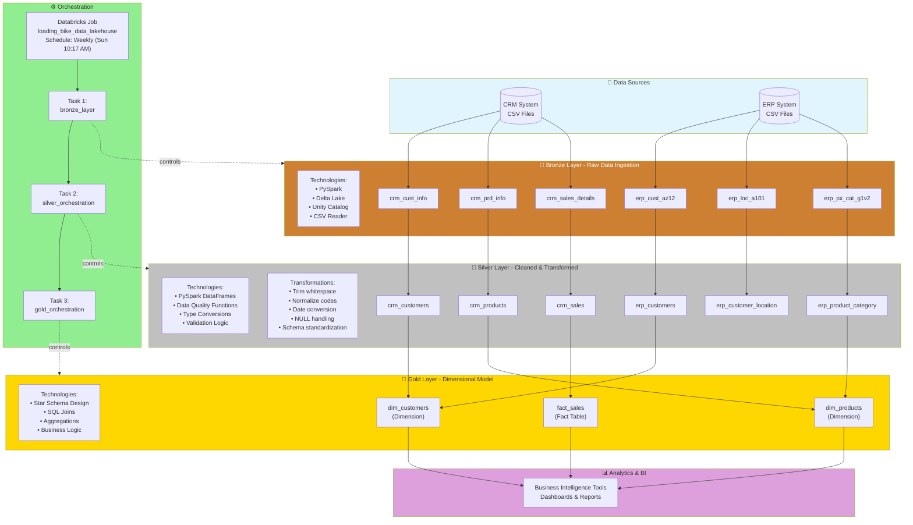
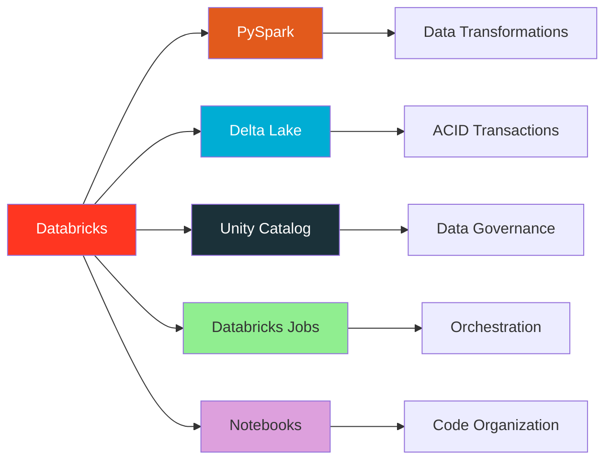
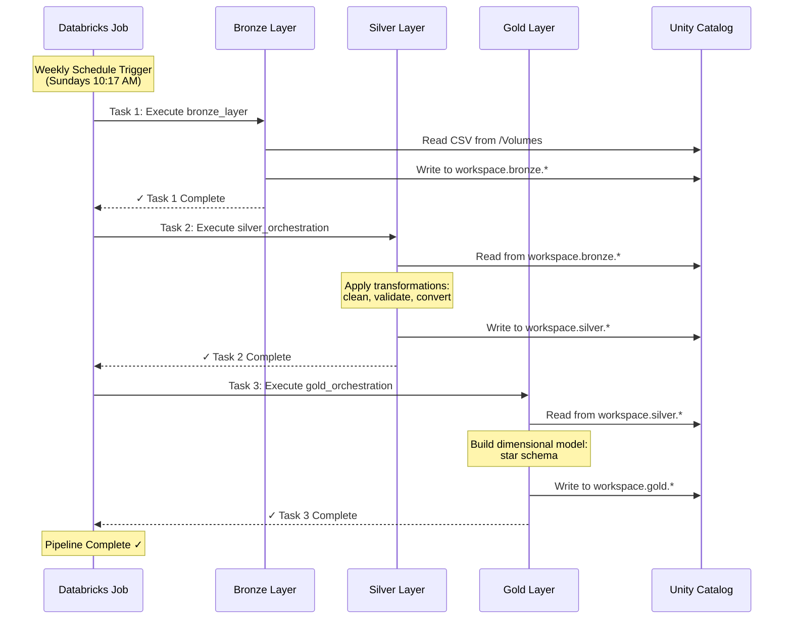
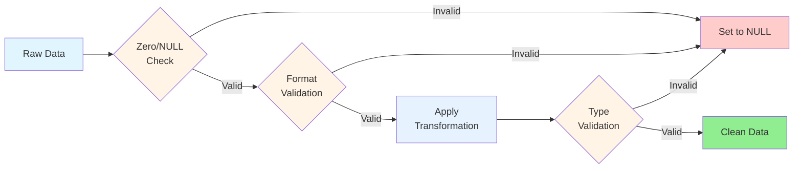

# Architecture Diagram

## Data Flow Overview

---

## Layer Details

### 🥉 Bronze Layer (Raw Zone)
**Purpose**: Ingest raw data with no transformations

**Technologies**:
* PySpark for data reading
* Delta Lake for ACID transactions
* Unity Catalog for governance
* CSV file format support

**Schema**: `workspace.bronze`

**Tables**: 6 raw tables (3 CRM + 3 ERP)

---

### 🥈 Silver Layer (Cleansed Zone)
**Purpose**: Clean, validate, and standardize data

**Technologies**:
* PySpark DataFrame transformations
* Built-in data quality functions (trim, coalesce, when)
* Type casting and conversions
* Custom validation logic

**Key Transformations**:
1. **String Cleaning**: Remove leading/trailing spaces
2. **Code Normalization**: S→Single, M→Married/Male, F→Female
3. **Date Conversion**: YYYYMMDD integers → DateType with validation
4. **NULL Handling**: Defensive coding with coalesce and validation
5. **Schema Standardization**: Consistent column names and types

**Schema**: `workspace.silver`

**Tables**: 6 cleaned tables

---

### 🥇 Gold Layer (Curated Zone)
**Purpose**: Business-ready dimensional model for analytics

**Technologies**:
* Star schema design
* SQL for complex joins
* Business logic implementation
* Performance optimization

**Model**: Star Schema
* **2 Dimensions**: Customer & Product
* **1 Fact Table**: Sales transactions

**Schema**: `workspace.gold`

**Tables**: 3 tables (2 dimensions + 1 fact)

---

## Technology Stack

---

## Orchestration Flow

---

## Data Quality Framework

